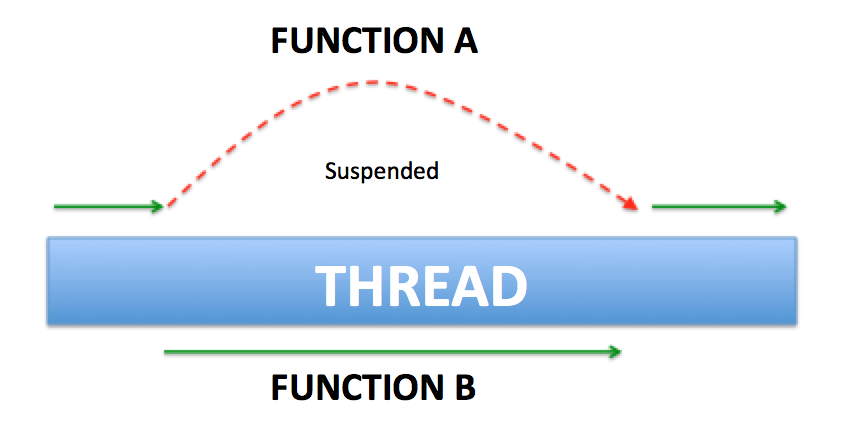

# Kotlin Coroutines Seminar

## I. Giới thiệu về Kotlin Coroutine

### 1. Coroutine là gì?
- Couroutine trong Kotlin giúp viết code bất đồng bộ một cách dễ đọc, dễ hiểu 
- Coroutine giống như **light-weight thread** nhưng không phải là thread giúp bạn chạy các tác vụ như: đọc/ghi file, xử lý nền... mà không làm đứng (block) giao diện người dùng.
- Giống thread ở chỗ:
  - Có thể chạy song song.
  - Có thể đợi nhau và trao đổi dữ liệu.
- **Khác biệt lớn nhất**:
  - Có thể chạy hàng nghìn coroutine mà không ảnh hưởng nhiều đến performance.
- Một thread **có thể chạy nhiều coroutine**.
  
---

## II. Build First Coroutine with Kotlin

### 1. Thêm dependencies

```kotlin
implementation 'org.jetbrains.kotlinx:kotlinx-coroutines-core:1.2.1'
implementation 'org.jetbrains.kotlinx:kotlinx-coroutines-android:1.1.1'
```

### 2. Cấu trúc một coroutine

```kotlin
GlobalScope.launch {
    delay(10000L)
    println("World,")
}
println("Hello,")
Thread.sleep(20000L)
println("Kotlin")
```

### Output

```text
Hello,     // Giả sử Hello được in ra ở giây thứ 1
World,     // In ra ở giây thứ 11
Kotlin     // In ra ở giây thứ 21
```

- GlobalScope là coroutine scope. Chúng ta không thể launch một coroutine nếu nó không có scope.
- launch khởi động một coroutine mới và không trả về kết quả cho phương thức gọi. 
- async bắt đầu một coroutine mới và cho phép bạn trả về kết quả bằng một lệnh tạm ngưng có tên là await.

---

## III. Blocking vs Non-Blocking / Normal Function vs Suspend Function

### 1. Blocking

- Chạy tuần tự từ trên xuống dưới.
- **Chặn thread** đang chạy.

### 2. Non-blocking

- Coroutine hỗ trợ mô hình **non-blocking**:
  - Không cần nhiều thread.
  - Một thread vẫn có thể chạy nhiều coroutine theo kiểu non-blocking.

### 3. Suspend Function
- Là function có thể **bị tạm dừng** (`suspend`) và **resume lại** mà không block thread.
- Cho phép coroutine tạm dừng ở giữa rồi tiếp tục khi có kết quả.
- Bạn chỉ có thể gọi các hàm suspend từ các hàm suspend khác hoặc bằng cách sử dụng một hàm tạo coroutine như launch để bắt đầu một coroutine mới.

#### Ví dụ hoạt động của `suspend`

```
FunctionA -> suspend -> FunctionB -> resume FunctionA
```

### 4. RunBlocking

- Khi muốn coroutine chạy theo kiểu **blocking**:

```kotlin
runBlocking {
    println("Hello")
    delay(5000L)
}
println("World")
```

---

## IV. Coroutine Context và Dispatcher

### 1. Coroutine Context

- Mỗi coroutine có một `CoroutineContext`.
- Là tập hợp các **element cấu hình** cho coroutine.

### 2. Các loại Element (Dispatcher)

| Dispatcher                  | Mô tả                                                                 |
|----------------------------|------------------------------------------------------------------------|
| `Dispatchers.Main`         | Chạy trên **UI Main Thread**                                          |
| `Dispatchers.IO`           | Chạy trên background thread - dùng cho **I/O, DB, Networking**        |
| `Dispatchers.Default`      | Chạy background thread - dùng cho **CPU-bound tasks**                 |
| `newSingleThreadContext()` | Tạo **thread riêng** có tên                                            |
| `newFixedThreadPoolContext(n)` | Tạo thread pool có **n thread**                         |
| `Dispatchers.Unconfined`   | Chạy **ở thread gọi coroutine**, không bị "confined" (ràng buộc)      |

### 3. Default Context

- Nếu không set context:
```kotlin
GlobalScope.launch {
    // mặc định là Dispatchers.Default + Job()
}
```

### 4. Ví dụ với `Dispatchers.Unconfined`

```kotlin
fun main() = runBlocking {
    launch(Dispatchers.Unconfined) {
        println("Unconfined      : I'm working in thread ${Thread.currentThread().name}")
        delay(1000)
        println("Unconfined      : After delay in thread ${Thread.currentThread().name}")
    }
}
```

### Output

```text
Unconfined      : I'm working in thread main
Unconfined      : After delay in thread kotlinx.coroutines.DefaultExecutor
```

> `Dispatchers.Unconfined`: ban đầu chạy trên thread gọi coroutine, sau `suspend` sẽ resume trên một thread khác (ví dụ: `DefaultExecutor`).

---
### 5. Hàm withContext
- Nó là một suspend function cho phép coroutine chạy code trong block với một context cụ thể do chúng ta quy định. 
```kotlin
GlobalScope.launch(Dispatchers.IO) {
    println("Start fetch: ${Thread.currentThread().name}")
    val user = fetchUserFromApi()
    println("After fetch: ${Thread.currentThread().name}")

    withContext(Dispatchers.Main) {
        println("On Main thread: ${Thread.currentThread().name}")
    }
}
```
### Output
```text
Start fetch: DefaultDispatcher-worker-2
After fetch: DefaultDispatcher-worker-2
On Main thread: main
```
---

## IV. Job, Join, Cancellation
### 1. Job - một element trong coroutine context
- Trong coroutine context có một element là Job giữ nhiệm vụ nắm giữ thông tin về lifecycle của coroutine, cancel coroutine, ... Mỗi khi chúng ta launch một coroutine thì nó trả về một đối tượng Job.
```kotlin
val job = GlobalScope.launch { // launch a new coroutine and keep a reference to its Job
       delay(5000L)
       println("World!")
   }
```
---

### 2. Hàm join()
- Khi một coroutine gọi hàm join() này thì tiến trình phải đợi coroutine này chạy xong task của mình rồi mới chạy tiếp. Ví dụ:
```kotlin
fun main() = runBlocking {
   val job = GlobalScope.launch { // launch a new coroutine and keep a reference to its Job
       delay(5000L)
       println("World!")
   }
   println("Hello,")
   job.join() // wait until child coroutine completes
   println("Kotlin")
}
```
### Output
```text
 I/System.out: Hello
 I/System.out: World
 I/System.out: Kotlin
```
---

### 3. Hàm cancel()
- Để dừng và hủy bỏ một coroutine đang chạy. Ta có thể dùng method cancel() của biến Job
```kotlin
fun main() = runBlocking {
    val job = launch {
        repeat(1000) { i ->
            println("I'm sleeping $i ...")
            delay(500L)
        }
    }
    delay(1300L) // delay a bit
    println("main: I'm tired of waiting!")
    job.cancel() // cancels the job
    println("main: Now I can quit.")    
}
```

### Output
```text
I'm sleeping 0 …
I'm sleeping 1 …
I'm sleeping 2 …
main: I'm tired of waiting!
main: Now I can quit.
```
---

### 4. Những lưu ý khi hủy bỏ một coroutine
#### 4.1. Coroutine cancellation is cooperative
- Thử dùng hàm cancel() để hủy bỏ coroutine trong đoạn code sau:
```kotlin
fun main() = runBlocking {
    val startTime = System.currentTimeMillis()
    val job = launch(Dispatchers.Default) {
        var nextPrintTime = startTime
        var i = 0
        while (i < 5) {
            if (System.currentTimeMillis() >= nextPrintTime) {
                println("job: I'm sleeping ${i++} ...")
                nextPrintTime += 500L
            }
        }
    }
    delay(1300L) // delay a bit
    println("main: I'm tired of waiting!")
    job.cancel() // cancels the job
    println("main: Now I can quit.")
}
```
### Output
```text
job: I'm sleeping 0 ...
job: I'm sleeping 1 ...
job: I'm sleeping 2 ...
main: I'm tired of waiting!
main: Now I can quit.
job: I'm sleeping 3 ...
job: I'm sleeping 4 ...
```
- Đó là vì quá trình hủy bỏ coroutine có tính hợp tác (Coroutine cancellation is cooperative). Một coroutine khi bị cancel thì nó sẽ chỉ set lại một property có tên là isActive trong đối tượng Job từ true thành false (job.isActive = false), còn tiến trình của nó đang chạy thì sẽ vẫn chạy bất chấp cho đến hết mà không bị dừng lại
---
#### 4.2. Sử dụng khối finally
- Nếu tiến trình của một coroutine bị hủy bỏ thì ngay lập tức nó sẽ tìm đến khối finally để chạy code trong đó.

```kotlin
fun main() = runBlocking {
    val job = launch {
        try {
            repeat(1000) { i ->
                println("I'm sleeping $i ...")
                delay(500L)
            }
        } finally {
            // close resource in block
            println("I'm running finally")
        }
    }
    delay(1300L) // delay a bit
    println("main: I'm tired of waiting!")
    job.cancel() // cancels the job
    println("main: Now I can quit.")
}
```
### Output
```text
I'm sleeping 0 ...
I'm sleeping 1 ...
I'm sleeping 2 ...
main: I'm tired of waiting!
main: Now I can quit.
I'm running finally
```
---
#### 4.3. Coroutine vẫn có thể chết trong khối finally
- Bây giờ, thử để hàm delay() bên trong khối finally của đoạn code trên thử xem:

```kotlin
fun main() = runBlocking {
    val job = launch {
        try {
            repeat(1000) { i ->
                println("I'm sleeping $i ...")
                delay(500L)
            }
        } finally {
            println("I'm running finally")
            delay(1000L)                      // hàm delay được thêm vào khối finally
            println("Print me please!")
        }
    }
    delay(1300L) // delay a bit
    println("main: I'm tired of waiting!")
    job.cancel() // cancels the job
    println("main: Now I can quit.")
}
```
### Output
```text
I'm sleeping 0 ...
I'm sleeping 1 ...
I'm sleeping 2 ...
main: I'm tired of waiting!
main: Now I can quit.
I'm running finally
```
#### 4.4. Làm cho coroutine bất tử
- NonCancellable sẽ giúp ta thực hiện điều này.
```kotlin
fun main() = runBlocking {
    val job = launch {
        try {
            repeat(1000) { i ->
                println("I'm sleeping $i ...")
                delay(500L)
            }
        } finally {
            withContext(NonCancellable) {
                println("I'm running finally")
                delay(1000L)
                println("I'm non-cancellable")
            }
        }
    }
    delay(1300L) // delay a bit
    println("main: I'm tired of waiting!")
    job.cancel() // cancels the job
    println("main: Now I can quit.")    
}
```
### Output
```text
I'm sleeping 0 ...
I'm sleeping 1 ...
I'm sleeping 2 ...
main: I'm tired of waiting!
main: Now I can quit.
I'm running finally
I'm non-cancellable
```
